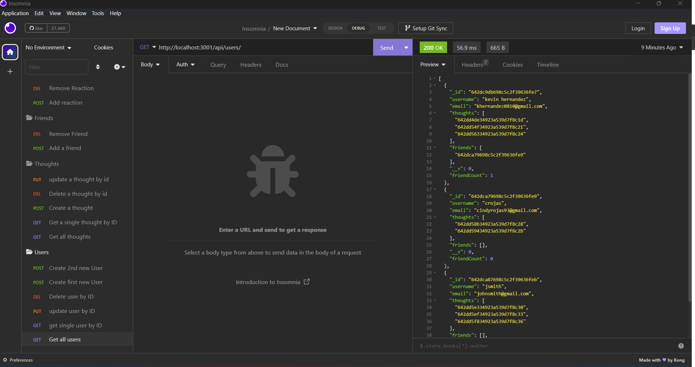

# justAnotherSocialNetworkAPI

## Screenshot of Application

  ## Description
  Here we will find a backend social media API in which you can add, create update and delete Users, Thoughts, Reactions to those thoughts all using Insomnia. Each user, thought and reaction is assigned an ID an associated to eachother as needed.
  ## Installation
  Git clonse the repository, after open your integrated terminal and run the npm install command, after that is complete, run npm run start and your server will be live to update on Insomnia.
  ## Usage
  download repo, npm install, npm start to initiate server and add link to the insomnia application to watch the magic happen
  

  ## Links
  <a href="">Link to walkthrough video</a>
  
  ## Questions
 If you have any questions regarding this project, Please contact me at: 
  GitHub: https://github.com/khernandez0810@gmail.com  
  Email: khernandez0810@gmail.com
  ## Credits
  Kevin Hernandez